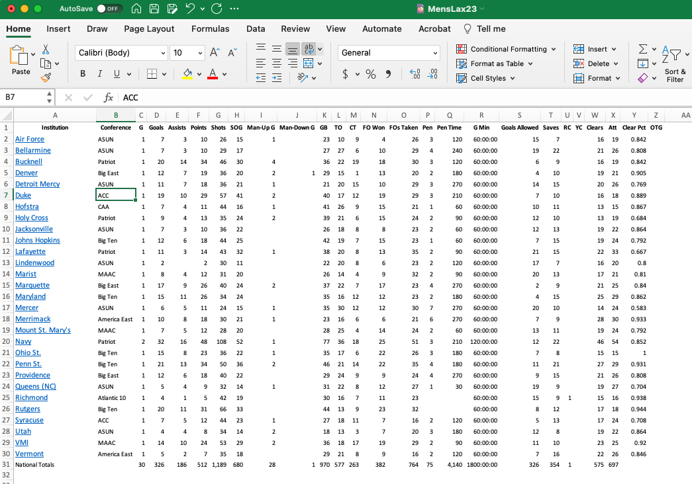

# NCAA Lacrosse Data

A repository of men's and women's lacrosse data scraped from stats.ncaa.org, plus the scrapers that did the work.

### Scraper Setup

To scrape match and player stats for both men's and women's matches, we first need a canonical list of teams for each season and their NCAA stats urls, derived from [this page](https://stats.ncaa.org/rankings/institution_trends) for each sport. Those CSV files are stored in the `url_csvs` directory, one for each season. There's no simple way to automate building those files, since we need the HTML for urls and the NCAA stats site doesn't have permalinks for each season (it could be automated using a browser emulator such as Selenium, however). But copying and pasting probably works fine for something we need to update only occasionally.

To create the teamurls\_{season}.csv files, grab the HTML source and, using a text editor, isolate the contents of the <table> tag. Save that file as HTML and then open it in Excel. It should look something like this:

.

What we want is a CSV file with the team name and URLs for player stats and match stats. Both of those follow predictable patterns:

* Player stats URL example: https://stats.ncaa.org/team/5/stats/15840
* Match stats URL example: https://stats.ncaa.org/player/game_by_game?org_id=5&game_sport_year_ctl_id=15840&stats_player_seq=-100

Where `/5/` is the NCAA ID (called org_id in the match stats URL) for a team and `/15840` is the NCAA code for the specific sport and year (called game_sport_year_ctl_id in the match stats URL). For 2023 men's lacrosse the sport and year code is 16320 for all teams. Given a list of teams and their IDs (which we can extract from the HTML links), we can construct those two URLs. That's why we need the HTML - to get the team IDs.

You can remove all of the columns from the Excel version of the HTML file except the one labeled `Institution`, and save it again. Then open the file in a text editor and start removing the HTML you don't need. Find and replace will do. What you want is a comma or tab-separated file with the URL segment (like `/team/721/16320`) and the team name in separate columns. Then you can replace those URL segment with the actual URLs you'll need for the scrapers to work.

### Scraper Details

The four scrapers - two for men's and women's lacrosse - are R scripts, not notebooks, so they can be run in RStudio by highlighting the entire script and clicking the "Run" button or from the command line using `Rscript name_of_file.R`. All scripts iterate over the list of teams for a given year, which you set at the top of the script, and pause for 2 seconds between each team.

